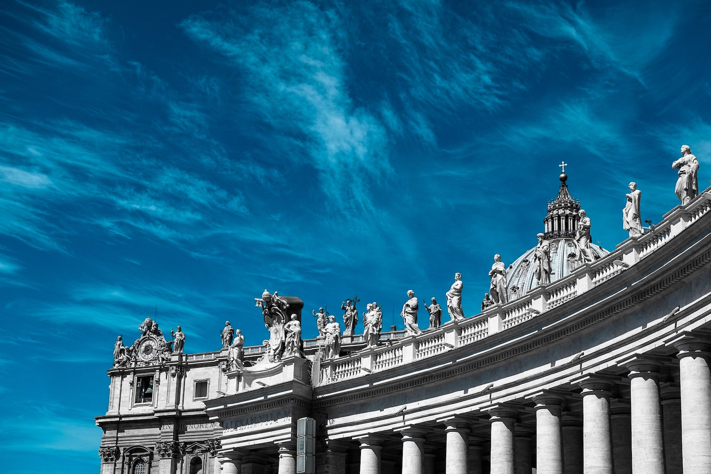
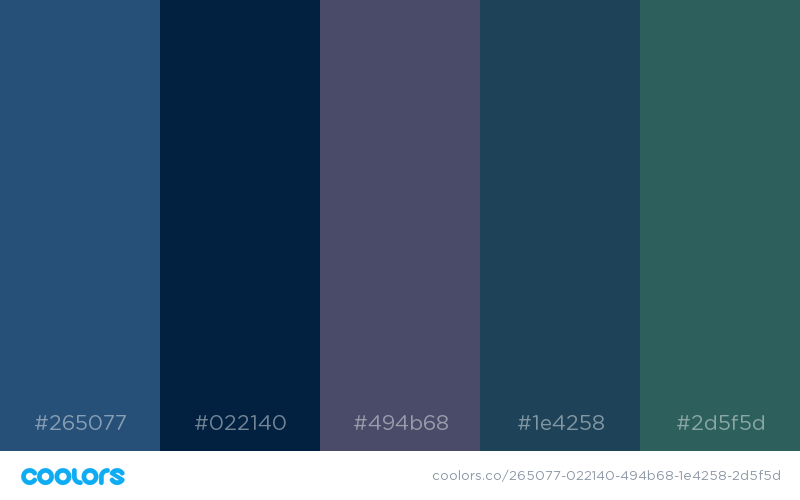

[](https://gitpod.io/#https://github.com/severian5it/ResidenceGiulioCesare) 

<div align="center">
    <h1>  Residence Giulio Cesare  </h1>
</div>

<div align="center">
    <a href="https://milestone1-pierluca.herokuapp.com/index.html"> View Website in Heroku </a>
</div>




## Table of Contents
1. [UX](#ux)
    - [Ideal Client](#The-ideal-client-for-this-business-is)
    - [Visitors' Searches](#Visitors-to-this-website-are-searching-for)
    - [Project's Purpose](#This-project-is-the-best-way-to-help-them-achieve-these-things-because)
    - [Client Stories](#client-stories)
    - [Wireframes](#wireframes)

2. [Features](#features)
    - [Existing Features](#existing-features)
        - [Navbar](#Navbar)
        - [Landing](#Landing-Page)
        - [Location](#Location)
        - [Carousel](#Room-Carousel)
        - [Attractions](#Attractions)
        - [Contact](#Contact-Form)
        - [Footer](#Footer)
        - [Alternate Language](#Alternate-Language-Version)
        - [Colors Palette](#Colors-Palette)
        - [Fonts](#Fonts)

    - [Features for Future Releases](#features-for-future-releases)

3. [Technologies Used](#technologies-used)
    - [Libraries](#libraries)
    - [Tools](#tools)


4. [Testing](#testing)

5. [Deployment](#deployment)
    - [How to run this project locally](#how-to-run-this-project-locally)
    - [Heroku Deployment](#heroku-deployment)

6. [Credits](#credits)
    - [Content](#content)
    - [Images](#images)
    - [Code](#code)
    - [Acknowledgements](#acknowledgements)

8. [Contact](#contact)

My project is about a fictional Residence in Rome, in proximity with the Vatican. 
User navigating to the site will be exposed to the following information:
* Residence Location
* a list of attractions located nearby, with brief description.
* a view of the rooms, with Link to Instagram Account
* a form to get in contact with the residence to book their accomodation
 
# UX

This is a website of a Residence/ B&B located in the hearth of Rome, providing services to the turist, such as
accomodation, for short and long stay, passage from city's airport and guided tours.

### The ideal client for this business is:
First and foremost, potential tourists or visitors, for every period of the year. Rome is a good destination regardless
of the season; then the site is targeting in particular:

* People without means of transportation.
* High-Spending segment, because it's located in a central and expensive neighbourhood.
* Returning clients, who wants to keep contact.
* Tourist that would like to enrich their experience with guided tours

### Visitors to this website are searching for:
* Location of the residence.
* List of tourist attractions in proximity.
* Contact.
* Pictures of the rooms.
* Links to related Social Networks.


### This project is the best way to help them achieve these things because:

People looking for an accommodation in their selected destination need to make an informed decision and they are usually
relying on a website with full visual and geo-localized content. 
The site is presenting them in a concise and easy-to-use way everything they need to know.

The goal was to make a strong first impact with the landing page, and therefore serve the most relevant information.

* Picture landing page, for striking first impression.
* A Carousel with photos showing the look and feel of the Rooms.
* A Section showing the location and address
* A Section showing pictures of closest interest point.
* A Section with a contact form for enquiries and bookings.
* A navigation bar and a footer

### Client stories

As a visitor of the *Residence Giulio Cesare* website I expect the following:

1. To find with ease what I am looking for, I want the layout of the site to make sense so I am not confused 
or frustrated using it. 

1. The information I am presented with to be laid out in a way that is easy for me to digest, so that I find my way 
through in the quickest possible way.

1. The site to be easily navigable from any device, desktop, tablet or phone. For the content to look good and 
be usable on any of these devices.

1. To learn more about the residence and their offering, so that I can make the best possible choice.

1. To easily locate it in the city of Rome.

1. To know which tourist attractions are close to it.

1. Plenty of high quality images of the Rooms where I can spend my vacation.

1. To be able to get in contact to the management in a quick and easy way.


### Wireframes

Wireframe mockups, created using [Balsamiq](https://balsamiq.com/), is available in diffent format:
 1. [Laptop](wireframes/Wireframe-Laptop.pdf)
 1. [Tablet](wireframes/Wireframe-Tablet.pdf)
 1. [Mobile](wireframes/Wireframe-Mobile.pdf)
 

# Features

All the different part of the project are detailed below.
 
## Existing Features

### Navbar
A responsive navigation bar with national flag on the top left. For mobile-sized devices a hamburger button on 
the top-right expands a menu with links to the different section on the website. On larger devices the expanded menu 
is shown instead. Navigation bar will be static on the top of the page.
### Landing Page
Landing Page presents a picture taken in the proximity of the residence, along with a presentation heading, that 
makes us of transformations to ease-in. The picture is different on different devices, and it's scaled by media queries.
### Location
A dedicated section for location has been designed, containing an *iframe* from google maps 
and a card with the address.
### Attractions
A dedicated section for close attractions has been designed, containing 4 responsive *cards*. Clicking on each of them,
a Modal gallery is openend, with possibilites to know more about each point of interest.
### Room Carousel
A carousel sliding through three images of the residence has been framed in a dedicate section. Naviagation is possible
via indicators or via control.
On the bottom of the page an icon to *Instagram* allows to see more.
### Contact Form

This page includes a form with 4 required fields:
* Name
* Phone Number
* Email Address
* Message

Controls have been implemented to avoid leaving the fields empty or to submit invalid mail addresses.
Once the form has been validated, a *modal* window will appear, informing the user that the data won't be 
actually submitted.
The picture in background is different on different devices, and it's scaled by media queries

### Footer

On the very bottom of the page a footer has placed, with link to the following Residence Resource:
* TripAdvisor
* Booking
* AirBnb


### Alternate Language Version

Via a `Italy/UK` flag button in the navigation bar is possible to switch between Italian or English Version of the site.

### Colors Palette



Shades of Blue and Grey have been used to convey a professional and stable image.

### Fonts

From Google Fonts has been used *Tangerine* font; for the rest of the Headings *Nobile* standard font has been used.

## Features for future releases
- A Section showing favourable user comments.

# Technologies Used

## Libraries

Beside the holy trinity of Web Development, HTML, CSS and JavaScript, I took advantage of the following technologies:

- [JQuery](https://jquery.com)
    - The project uses **JQuery** to improve Scroll Up between Section and to show a *Modal* after submitting Contact 
    Form.
- [Bootstrap](https://getbootstrap.com/)
    - The project relies heavily on **Bootstrap** component and predefined styles.
- [FontAwesome](https://fontawesome.com/)
    - **FontAwesome** is the source of the icons.
- [Popper.js](https://popper.js.org/)
    - **Popper** is used for the scrolling between different sections.
- [Google Fonts](https://fonts.google.com/) 
    - to style the website fonts
    
## Tools

In terms of Tools I used the following tools, to develop and design:

- [PyCharm](https://www.jetbrains.com/pycharm/)
    -  My favourite IDE, used to generate a local website and edit each file.
- [Balsamiq](https://balsamiq.com/)
    - WireFrame Designer, used with CodeInstitute license, definitively to best resource to wireframe.
- [Google Chrome](https://www.google.com/chrome/) and [Firefox](https://www.mozilla.org/en-US/firefox/new/)
    - Site has been tested on both popular Browser for several distinct dimensions.
    

# Testing

I used [W3C CSS Validation Service](https://jigsaw.w3.org/css-validator/) and [W3C Markup Validation Service](https://validator.w3.org/) 
to check the validity of the website code.

The work has been reviewed by a number of relatives and friend, mostly on the mobile, each of them giving suggestions.

The website has been test with multiple resizing to test the its responsiveness.
via the *inspect* chrome functionality it has been examined for the most popular mobile devices such as 
* iPhone 6/7/8
* iPad
* Galaxy S5

also following section has been tested:

1. Iframe Map: zooming in and out of the map.

1. Carousel: sliding through the rooms' pictures composing the carousel, testing indicators at the bottom
of the slides.

1. Contact form via the following routine:
    1. Going to the "Contact" Section
    2. Trying to submit the empty form and verify that an error message about the required fields appears
    3. Trying to submit the form with an invalid email address and verify that a relevant error message appears
    4. Trying to submit the form with all inputs valid and verify that the modal will appear.

1. Gallery to showcase the closest point of interest.

Bugs: most relevant bugs to tackle involved *bootstrap4 carousel* which arrows indicators
pushed navigation to the top of the section, but changing the `data-target` field solved it.
Other issues involved the JavaScript-powered scrolling which at some point was not adapting 
to new component added, and this meant refactoring from the original version.

Navigation with key was not enabled by default on galley modals, so I had to write a jQuery function 
on my own.

A Bug I wasn't able to reproduce was the scrollbar at the bottom that was appearing on some laptop; despite 
my effort it never showed up during my testing.

# Deployment

Site has been developed on PyCharm and pushed to GitHub via terminal commands.
code can be fetched locally with following command
```shell
git clone https://github.com/severian5it/Milestone1.git
```
## how to run this project locally
is possible to run it locally running a python server on the same location on index.html and then visiting 
*localhost:8000*
```python
python -m SimpleHTTPServer
```
## heroku deployment
Code was deployed to heroku which features a full integration with git with the following commands.
First with heroku create CLI command, that  creates a new empty application on Heroku, 
along with an associated empty Git repository
```shell
heroku apps:create milestone1-pierluca
```
then, every time the local development was satisfying, the local branch good be pushed to heroku
with following instruction:
```shell
git push heroku master
```
no variable must be set, all the dependency are managed by the file `index.php`, which presence is mandatory
, and must containg entry point for the application, as below:
```php
<?php header( 'Location: /index.html' ) ;  ?>
```


# Credits

### Content
- The structure of the project was modeled on the examples provided by the **Code Institute**, in particular on 
[Haley Schafer Portfolio](https://github.com/Code-Institute-Solutions/StudentExampleProjectGradeFive)

Really useful resources during development were [W3school](https://www.w3schools.com/) and [Stack Overflow](https://stackoverflow.com/)


## Media
- The photos used in the Landing section was downloaded from [Unsplash](https://unsplash.com/), and credit goes to 
to *Xavier Coiffic*.
- The photos used in the Contact section was downloaded from [Unsplash](https://unsplash.com/), and credit goes to 
*Cristina Gottardi*.
- The photos used for *Vatican museum* in the Attractions section was downloaded from [Unsplash](https://unsplash.com/), 
and credit goes to *Cezar Sampaio*.
- The photos used for *Vatican* in the Attractions section was downloaded from [Unsplash](https://unsplash.com/), 
and credit goes to *Nils Huber*.

- The photos used for *Angel Castle* in the Attractions section was downloaded from [Unsplash](https://unsplash.com/), 
and credit goes to *Michele Bitetto*.
## Acknowledgements

- I received inspiration for this project from my mentor, *Aaron Sinnot*.

# Contact
To contact me feel free to email

 `pdelbuono@gmail.com`


